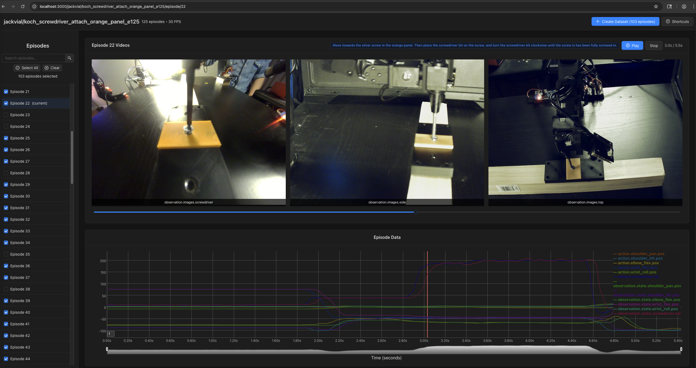
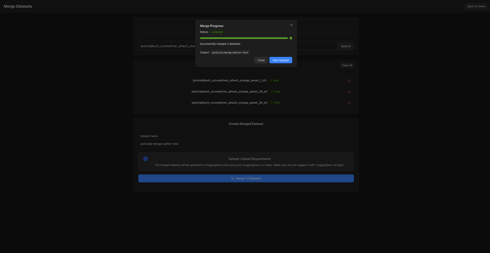

# LeRobot Data Studio - Unofficial LeRobot Dataset Editor

A web-based GUI for editing and merging LeRobot datasets.

*Note: This is an unofficial tool and is not affiliated with Huggingface, LeRobot or the LeRobot team.*

## Main Features
- Merge multiple datasets into a single dataset
- Easily remove episodes and create new clean datasets
- Speed control and keyboard shortcuts to streamline dataset cleaning





## Quick Start

### Step 1: Prerequisites
- [UV Python package and project manager](https://astral.sh/uv/): `curl -LsSf https://astral.sh/uv/install.sh | sh`
- Python 3.10+ (You can use uv to install and manage python versions e.g. `uv python install 3.12`)
- Node.js 24+ (Install using nvm - see instructions below)
- A Huggingface account (free)
- [Huggingface CLI](https://huggingface.co/docs/huggingface_hub/en/guides/cli)

#### Installing Node.js with nvm

```bash
# Install nvm (Node Version Manager)
curl -o- https://raw.githubusercontent.com/nvm-sh/nvm/v0.40.3/install.sh | bash

# Reload your shell configuration
source ~/.bashrc  # or ~/.zshrc if using zsh

# Install and use Node.js 24
nvm install 24
nvm use 24

# Verify installation
node --version
```

### Step 2: Installation

```bash
git clone https://github.com/jackvial/lerobot-data-studio
cd lerobot-data-studio

# Create a virtual environment with UV
uv venv

# Activate the virtual environment
source .venv/bin/activate

# Install all packages using UV
uv sync
```

### Step 3: Install Frontend Dependencies

After completing the python installation, install frontend dependencies:

```bash
cd packages/lerobot-data-studio/frontend
npm install
```

### Step 4: Running the App

Use the provided script to start both frontend and backend servers:

```bash
./run_dev.sh
```

## Dataset Creation
Dataset creation for merged and filtered (AKA edited) datasets is always none destructive and will always create a new dataset and upload it to the Huggingface Hub.

### Merged Dataset Creation

Merges multiple datasets into a single new dataset and uploads it to the Huggingface Hub.

### Filtered Dataset Creation
Editing/filtering a dataset creates a new dataset that only excludes the episodes that were selected in the UI.

## Development

### Run Backend Tests

```bash
uv run pytest
```

### Run Frontend Tests

```bash
cd src/lerobot_data_studio/frontend
npm run test
```

### Contributing

Contributions are welcome!

### License

This project is licensed under the MIT License - see the [LICENSE](LICENSE) file for details.